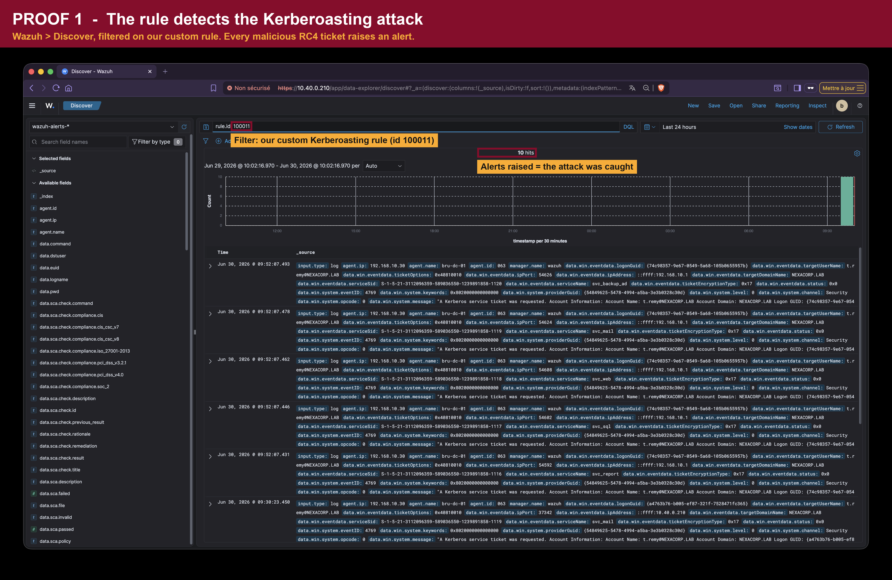
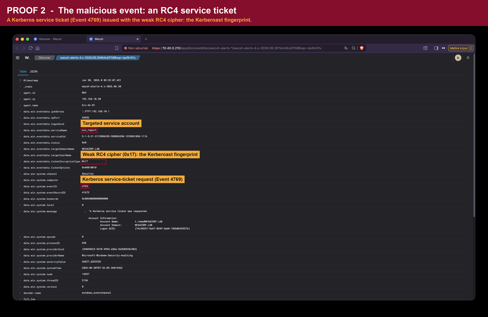
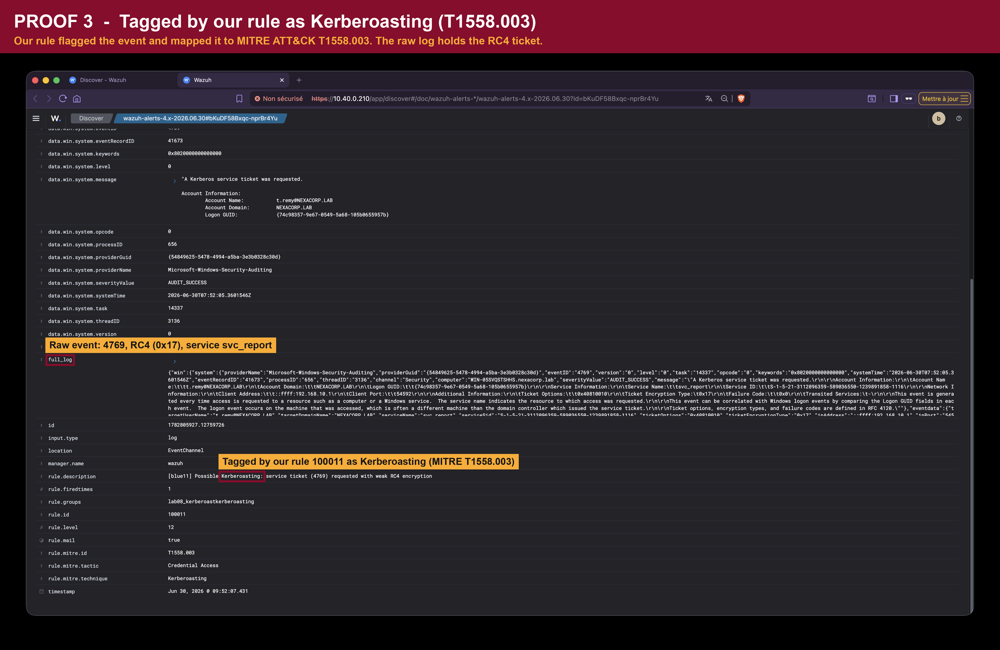
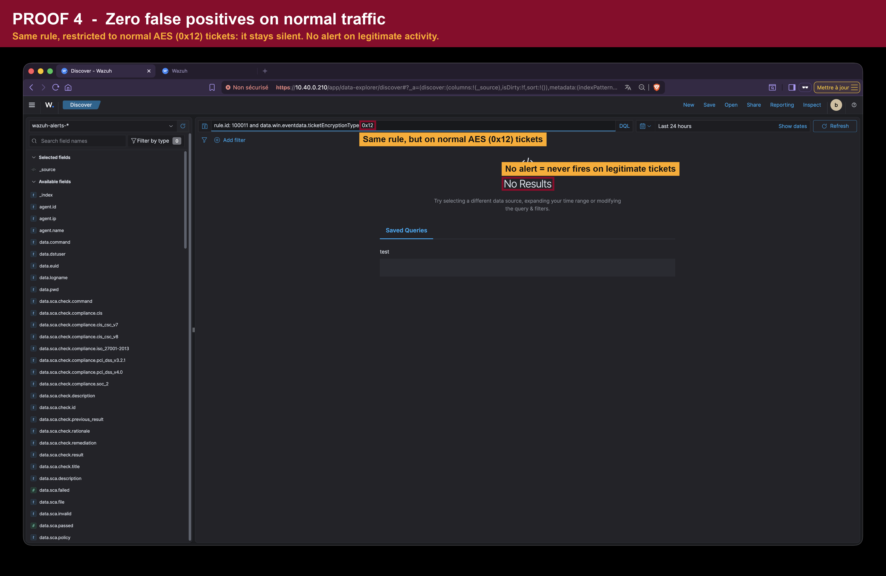

# Detection Engineering: INC-2026-008

Phase 2 deliverable: a Wazuh rule that detects Kerberoasting (MITRE T1558.003) without drowning the analyst in false positives.

## Design principle

A normal Kerberos service-ticket request (Event 4769) is issued with strong AES encryption (`0x11` / `0x12`). A Kerberoast deliberately forces the weak legacy RC4 cipher (`0x17`) so the ticket can be cracked offline. The rule therefore keys on **the encryption type, not the account name**, so it catches any future roast rather than only `svc_report`.

## Per-rule logic

`kerberoast_detection.xml` (primary rule, deployed as **rule.id 100011**):

- `win.system.eventID` = `4769` (service-ticket request)
- `win.eventdata.ticketEncryptionType` = `0x17` (RC4-HMAC, the weak cipher)
- `level` 12, MITRE `T1558.003`

The same `kerberoast_detection.xml` also holds a second rule, `100801`: a correlation rule that escalates when one source IP requests several RC4 service tickets in a short window (mass roast). The lab validator deploys only the first rule per submission, so `100801` is kept as design for a real SOC `local_rules.xml`, not deployed in the lab.

## Offline proof (from the evidence)

In the incident evidence, exactly 2 of 2697 Event 4769 records used `0x17`; both are the attack. A rule matching `0x17` on Event 4769 would have fired on those two and stayed silent on the other 2695 AES tickets.

Validated live on the lab Wazuh manager: a controlled roast of all five SPN service accounts produced five `rule.id 100011` alerts on the RC4 (0x17) Event 4769 records and zero on normal AES (0x12) traffic, confirming the rule fires on the attack and stays silent on legitimate tickets.

## Live proof (screenshots)

Captured in the Wazuh dashboard (Threat Hunting > Discover) after a controlled roast against the lab domain controller. Each screenshot has a title banner and red callouts; the unannotated originals are in [`screenshots/raw/`](screenshots/raw/).

1. The rule fires on every RC4 (0x17) service ticket (the roast hit all five SPN accounts):

2. The malicious event: a service ticket (Event 4769) issued with the weak RC4 cipher (0x17) for svc_report:

3. The alert: the event tagged by rule.id 100011 and mapped to MITRE T1558.003 (Kerberoasting):

4. No false positives: the same query restricted to AES (0x12) returns nothing, so the rule never matches a normal service ticket:

## False-positive analysis

- The rule never matches AES (`0x12` / `0x11`) traffic, which is the overwhelming majority of normal service tickets.
- If NexaCorp runs legacy services that legitimately negotiate RC4, they would be excluded explicitly via a documented `<list>` so the rule cannot drift. None were present in this evidence set, so no exclusion is implemented.
- Prevention complements detection: disabling RC4 domain-wide (AES-only) and moving service accounts to gMSA removes the weakness class entirely.

## Environment

- Wazuh decoder: `windows_eventchannel`; fields under `data.win.eventdata` (flattened to `win.eventdata.*` in rules).
- Deployed and validated on the lab Wazuh manager; rule.id 100011 assigned on PASS.
